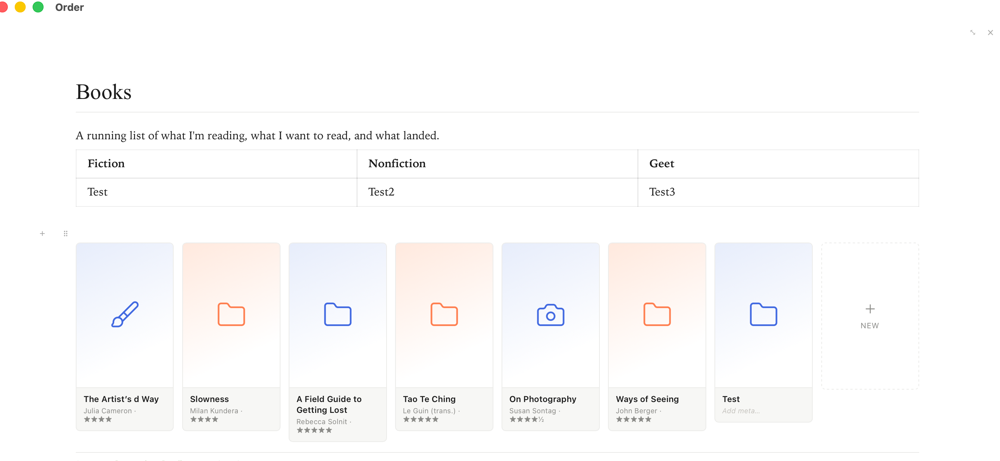

# Order

*Your notes, at home at last.*

A specialized note app. One screen for thinking, browsing, and (eventually) publishing.
Local markdown files, YAML frontmatter as the source of truth, Obsidian-compatible vault.
Built with Tauri v2 — same codebase ships desktop today and iOS next.


---

## Principles

1. **Local-first.** Files live on your machine as plain `.md` with YAML frontmatter.
   No proprietary store, no cloud lock-in. Sync is whatever you already use
   (Dropbox, iCloud, git).
2. **Portable conventions.** The vault opens cleanly in Obsidian. Same files, same
   YAML, same wikilinks. Order is a different surface on the same data.
3. **Edit in place.** Every interaction — capture, browse, refine — happens on the
   same surface. No modals, no editor/viewer toggle. Double-click and type.
4. **Constraint as clarity.** Johnny Decimal limits: max 10 Areas, max 10 Categories
   per Area. The 10-box grid makes the limit visible. No tags, no plugins, no graph
   view — structure is a forcing function for better thinking.
5. **Workspace is presentation space.** What you see while editing is what your
   reader sees. There's no separate "article view."
6. **Subtle UI.** Two accents only — royal blue `#4169E1` and coral `#FF7F50`.
   Sans-serif for chrome, serif for prose. Whitespace and hairlines do the work
   of borders.
7. **Speed matters.** Startup, scan, filter, edit, save — all optimized for flow.

---

## The hierarchy

- **Area** — broadest level, max 10 per vault (e.g. *Personal*, *Projects*).
- **Category** — within an Area, max 10 (e.g. *Reading* within *Personal*).
- **Notable Folder** — within a Category. A note whose YAML carries `category:`.
  Holds a Main Document (long-form prose, a curated list, or an auto-grid) plus
  any number of regular notes that link to it via `folder: "[[Folder Name]]"`.

Areas and Categories are derived from the Notable Folders themselves (no separate
storage). Names you've explicitly added are persisted in `localStorage` under
`order.taxonomy` so empty Areas / Categories survive a vault scan.

---

## Inspirations

- **Typora** — WYSIWYG markdown that hides syntax until you put your cursor on the
  line. Order uses Milkdown Crepe, which gives the same feel without the licensing
  question.
- **[Tolaria](https://github.com/...)** — root-owned-hooks architecture and the
  insight that note metadata belongs in YAML, not a sidecar database.
- **Obsidian** — the vault model (a plain folder of markdown files) and Bases
  (structured cards over frontmatter). Order's `type: list` folders draw straight
  from Bases.
- **Johnny Decimal** — the 10×10 constraint that makes hierarchy honest.
- **Google Keep** — card-grid browsing on desktop; frictionless capture as the bar
  for "how easy a new note should feel."
- **Wikipedia** — Main Document per Folder; reading and editing share the same
  prose surface.
- **Medium** — typographic restraint. No borders or fills in resting state; hover
  is the only visual change.
- **NYT** — hairline dividers between cards, never heavy chrome.

The combination is the point. Order ties them into one coherent surface and takes
only the single best thing from each.

---

## Architecture

### Stack

- **Tauri v2** — Rust shell, system webview. Native window, native file IO, ships
  desktop today (`pnpm tauri:dev`) and iOS from the same codebase.
- **React 19 + TypeScript** — single-page app rendered into the webview.
- **Vite** — dev server with HMR on `localhost:1420`.
- **[Milkdown Crepe](https://milkdown.dev/)** — ProseMirror-based WYSIWYG markdown
  editor. One instance per Card; uncontrolled after mount.
- **[FullCalendar v6 React](https://fullcalendar.io/)** — Week and Month calendars.
  Year is a hand-rolled linear strip (`YearLinearView.tsx`) ported from a fork
  of `obsidian-full-calendar`.
- **js-yaml** — frontmatter parse / dump on the JS side.

### Source of truth

The on-disk markdown file is authoritative. Every save round-trips through
`splitFrontmatter` → mutate → `joinFrontmatter` so out-of-band edits (calendar
drags, sidebar mutations, the editor itself) compose cleanly. The Rust side
exposes thin file-IO commands (`read_text`, `write_text`, `write_binary`,
`rename_file`, `delete_file`) and stays out of the schema entirely.

### Storage layout

```
<vault root>/
├── Areas.md               navigation root — list of Areas
├── Personal.md            an Area — list of Categories (no children on disk)
├── Reading.md             a Category — list of Notable Folders (no children on disk)
├── Books/                 a Notable Folder — directory holds the notes
│   ├── Books.md             Main Document for the folder
│   ├── On Photography.md    a leaf note
│   └── reading-stats.html   sidecar artifact (any file type is welcome)
├── log/                   default Notable Folder — catch-all for un-categorized notes
│   └── 2026-05-19.md
└── Attachments/           pasted / dropped images, Obsidian convention
    └── foo.png
```

Only Notable Folders are directories with contents on disk — Areas and
Categories are markdown files that exist purely to organize the level below
them. Image uploads write to `Attachments/`. The markdown on disk stores
**relative** paths (`Attachments/foo.png`) for portability; at edit time those
paths are inflated to absolute `asset://` URLs so the webview can render them,
and deflated back on save.

### State

No Redux / Zustand / Context. `CardGrid` is the top-level component and owns the
loaded `notes[]`, the current view, the folder filter set, and the right-sidebar
open state. Cards manage their own load + debounced save lifecycle and call
parents back via props when their path / title / frontmatter changes.


```
CardGrid                 # top: loads notes, owns view + filter state
├── Sidebar              # drill: Areas → Categories → Notable Folders
├── Card[]               # Stream view; each card owns its file
│   ├── MilkdownSurface  # editor
│   └── ListView         # ListCards / ListLines for any list folder
├── CalendarView         # Week / Month
├── YearLinearView       # Year — 12 rows × 37 cells
└── CommandPalette       # Cmd+K folder picker
```

### List folders

A list folder is any note whose YAML carries a `list:` key. The value names the
render style:

```yaml
---
list: cards   # or "lines"
---

# Books

- [[On Photography]] · Susan Sontag · ★★★★½
- [[Slowness]] · Milan Kundera · ★★★★
```

Bullets of wikilinks in the body are the source of truth for what's in the
list and in what order. On load we split them off the prose (the editor only
sees the prose); on save we serialize them back. Legacy `type: list` is still
read (treated as `list: cards`) so vaults from before the unification render
without migration.

#### Renders

- **`list: cards`** — basecard masonry, cover image (from the linked note's
  `image:` field) or alternating royal/coral icon fallback, title, meta.
- **`list: lines`** — dense one-row-per-item layout, drag-handle on hover,
  click-to-edit title and meta.



Both renders share the same operations: drag-reorder with insertion-point
preview + FLIP-animated nudge, click-to-edit title and meta inline, hover-×
to delete, "+ New" tile/row to append. Pointer events end-to-end — Tauri's
webview intercepts HTML5 drag-drop at the OS layer so `drop` never reaches
in-page handlers.

#### Areas, Categories, Notable Folders — also list folders

The three-level hierarchy is one consequence of the list model, not a separate
concept:

- `<vault>/Areas.md` — `list: cards, role: areas`, capped at 10 bullets
- each Area file — `list: cards`, bullets are Category wikilinks, capped at 10
- each Category file — `list: cards`, bullets are Notable Folder wikilinks
- each Notable Folder's Main Document (inside the folder's directory) —
  `list: cards` (or `lines`), bullets are leaf notes

The sidebar drill walks this chain. The 10-item caps fire from the same
add-bullet path that any list folder uses; over-cap attempts flash a coral
toast at the bottom of the screen and refuse the write.

A one-shot migration runs on first launch: if no Areas.md exists, Order
generates the chain from the legacy localStorage taxonomy + any Notable
Folder Main Docs (notes with `category:` in YAML), and rewrites those notes'
YAML to swap `type: list → list: cards`.

#### Base blocks — auto-populated lists

A fenced ```` ```base ```` code block inside a list folder body auto-populates
the list from the rest of the vault, Obsidian Bases style:

````yaml
```base
filters:
  and:
    - folder.contains("Books")
views:
  - type: cards
    name: All Books
    sort:
      - property: file.mtime
        direction: DESC
    image: note.image
```
````

Supported subset: `filters` with `and:`/`or:` composition; `.contains(string)`
predicates; `file.name`/`file.folder`/`file.ctime`/`file.mtime` and arbitrary
frontmatter keys; first `views[]` entry only; `view.type` of `cards` or `lines`;
single-key `sort`; `image: note.<field>` for the cover. Anything outside the
subset is parsed, ignored, and surfaced as a coral "(N unsupported)" hint
above the grid.

**Smart merge** preserves user reordering across regenerations. The base block
is the source of truth for which items appear; the host note's
`manual_order: [refs…]` YAML key is the source of truth for what order. On
render: items still matching the base keep their saved position; newly-matched
items append in the base's `sort` order; items no longer matching drop out.
Drag in base mode updates `manual_order`. A "Reset order" button above the
grid clears it.

In base mode the membership UI is read-only — no add tile, no per-item delete,
no inline rename (membership is the filter, not bullets) — but drag-reorder
stays available.

#### Lists of lists

When a list folder's items resolve to other list folders, the parent renders
as lines and each row gets the sub-list expanded inline below it. The sub-list
honours its own `list:` value: `list: lines` shows as compact indented
bullets, `list: cards` as a small basecard grid (read-only). Expansion is
capped at 12 items per row so a long sub-list doesn't crowd the parent.

#### Click-to-navigate

Any item title whose linked target exists in the vault renders in royal blue
and navigates on click — sets the folder filter to that ref so the Stream
focuses on just that note. Items pointing at notes that don't exist yet fall
back to inline rename, so broken/placeholder wikilinks stay editable.

### Files and organization

Order doesn't require any particular layout on disk — any `.md` in the vault
shows up in the Stream regardless of where it sits. The defaults are a
convention, not a constraint, and the convention is small on purpose:

- **Notable Folders are the only place notes and files live.** Areas and
  Categories are pure navigation — they organize Notable Folders, never hold
  notes or files directly. This is the Johnny Decimal rule: only the leaf
  level of the hierarchy holds items. Every note belongs to exactly one
  Notable Folder.
- **`log/`** is the default Notable Folder — the catch-all for anything that
  doesn't naturally fit a Category. Quick captures, scratch, daily notes
  land here rather than scattering loose at the root.
- **`Attachments/`** at the vault root holds pasted and dropped images, plus
  any other binary attachments, following the Obsidian convention.

The point isn't structure for its own sake. It's the smallest set of rules
that keeps the vault legible at 10 notes and at 10,000, leaves room to grow
into new file types without revisiting the layout, and stays honest to the
spirit of Johnny Decimal — a place for everything, with the constraint as
the thing that makes that possible.

A few things follow from this:

- **Order isn't a file browser, and isn't trying to be one.** Obsidian, VS
  Code, and Finder are already excellent at browsing arbitrary trees. Order's
  job is to browse Notable Folders efficiently and edit the notes inside them.
  Reach for one of those other tools when you need to see the whole tree.
- **Other file types are first-class citizens of a Notable Folder.** AI tools
  increasingly produce sidecar artifacts — HTML one-pagers, generated diagrams,
  exported PDFs, scratch JSON. Drop them next to the Main Document in the
  Notable Folder's directory. Order won't render them, but they have a home
  next to the note they belong to, and your other tools will find them exactly
  where you'd expect.

### Masonry layout

The Stream uses CSS Grid with `grid-auto-rows: 8px` plus a per-cell `grid-row-end:
span N` computed from the card's measured height. Reflow triggers come from
three independent sources:

- **ResizeObserver** on each `.order-card` — image loads, fullscreen, breadcrumb.
- **Per-card MutationObserver** — ProseMirror DOM mutations as you type.
- **Capturing `input` / `keyup` listener** on the grid — backstop in case MO's
  attribute filter ever misses a frame.

### Keyboard

- `Cmd +/-/0` — webview zoom (uses Tauri's native setZoom, not CSS, so caret
  hit-testing stays correct).
- `Cmd O` — open the right sidebar and focus the folder search.
- `Cmd K` — open the centered command palette to toggle folder filters.
- `Cmd ;` — toggle the right sidebar.

---

## Run it

**Prereqs**
- Node 20+, pnpm
- Rust toolchain (`curl --proto '=https' --tlsv1.2 -sSf https://sh.rustup.rs | sh`)
- Xcode + command-line tools (for iOS)

**Desktop**
```bash
pnpm install
pnpm tauri:dev      # dev window with HMR
pnpm tauri:build    # signed app bundle
```

**iOS**
```bash
pnpm tauri:ios:init   # one-time; generates the Xcode project
pnpm tauri:ios:dev    # opens iOS Simulator
pnpm tauri:ios:build  # device build
```

First launch reads `~/Documents/Dropbox/order/`. Areas.md and the Notable
Folder directories (with their Main Docs and seed notes) are written on first
run if absent; any other `.md` files you drop into a Notable Folder show up
on next scan.

---

## A note on disk

```yaml
---
folder: "[[Books]]"
author: Susan Sontag
rating: 4.5
date: "2026-05-13"
startTime: "08:15"
---

# On Photography

A meditation on the camera's relationship to the world.
```

A note becomes a **Notable Folder Main Document** when its YAML has a `category`
field. A list folder additionally carries `type: list` and its body holds the
wikilink bullets that the card grid renders.

## License

MIT.
