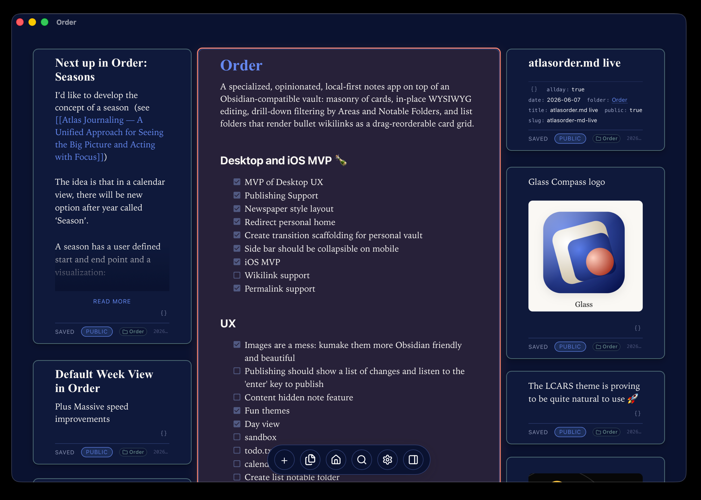
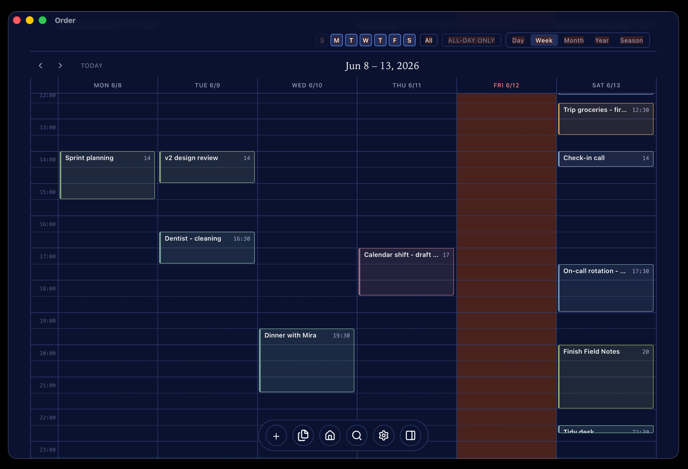

# Order

*Your notes, at home at last.*

A local-first notebook where **plain text files are the database** and every
surface (pile, calendar, seasons, todo.txt, spacetime) is a different read of
the same files. Obsidian-compatible vault. One Tauri codebase ships desktop and iOS.



## What you get

- **Edit in place** — WYSIWYG markdown cards (Milkdown Crepe). No modes, no preview pane.
- **Flip a card to a sheet or a drawing** — the same note becomes a spreadsheet (formulas, spreadsheet-style overflow, colors) or an Excalidraw canvas, backed by a sidecar file and remembered per note. See [SHEET-DRAWING.md](docs/SHEET-DRAWING.md).
- **List modes** — a note with `list:` frontmatter renders its bullets as `cards`, `lines`, or `masonry` (variable-height cards-on-a-card with inline links/images, drag-reorder, and an immersive fullscreen gallery).
- **A real hierarchy** — Areas → Categories → Notable Folders, capped Johnny-Decimal style at 10×10. A **Johnny-Decimal Mode** toggle in Settings makes the ids explicit (`10-19`, `11`, `11.01`) across `spacetime.md` and the directories.
- **A calendar that *is* your notes** — Day / Week / Month / Year / Season views over the same notes.
- **todo.txt, always in sync** — every calendar event mirrored as one readable line.
- **Seasons** — name your own date ranges and see each one as a grid of what happened, by Area.
- **Spacetime** — a single canonical map of your space (hierarchy) and time (events + seasons) at the vault root, in two companion formats: `spacetime.yml` and `spacetime.mw`. Edit either one and Order syncs the other immediately. See [SPACETIME.md](docs/SPACETIME.md).
- **Google Calendar curated sync** — push hand-picked events (with invites) to Google Calendar and pull a day's events back in, via the spacetime reconciliation flow. No Google IDs stored; identity is the natural key. See [GCAL-SYNC.md](docs/GCAL-SYNC.md).
- **Apple / system calendar (EventKit)** — pick which macOS/iOS system calendars to include, import a day's events into spacetime, and create events on a calendar with an `@[Calendar]` token. Native, no accounts. Invitations route through Google (Apple's API can't add guests). See [APPLE-CAL.md](docs/APPLE-CAL.md).
- **Publish from the same vault** — flip `public: true`, push, done. The site runs the same components read-only.

## Build & run

```bash
git clone https://github.com/geetduggal/order.git && cd order
pnpm install
pnpm tauri:dev        # desktop, hot reload
pnpm tauri:ios:dev    # iOS simulator (after tauri:ios:init)
pnpm test:e2e         # Playwright suite
```

Prereqs: Node 20+, pnpm 9+, Rust 1.77+; Xcode 15+ for iOS. First launch reads
`~/Documents/Dropbox/Home/` (change it in Settings).

**Using the prebuilt .app from a release?** macOS quarantines non-notarized downloads:

```bash
xattr -cr ~/Downloads/Order.app && open ~/Downloads/Order.app
```

## A vault at a glance

```
<vault>/
├── spacetime.yml             canonical space + time (YAML)
├── spacetime.mw              canonical space + time (Markwhen)
├── todo.txt                  one-line calendar events (optional)
└── Craft/                    an Area
    └── Craft Projects/       a Category
        └── Map Pipeline v2/  a Notable Folder
            ├── Map Pipeline v2.md       the Main Document
            ├── 2026-06-12 Standup.md    a note
            └── diagram.png              attachments live WITH their notes
```

The vault's structure (which Areas, Categories, and Notable Folders exist, and
their order) lives in `spacetime.yml` and `spacetime.mw`. The old chain index
files (`Areas.md`, `<Area>.md`, `<Category>.md`) are still supported as a fallback
for un-migrated vaults; the migration button in Settings moves them to safe storage
when you're ready.

## The surfaces

**Pile.** A masonry of editable cards, newest first. Focus on a Notable Folder
and it becomes a newspaper section — Main Document as the centerpiece, recent
notes orbiting it. Navigation is a pile: the folder you touch goes on top.

**Terminal.** Every Notable Folder's Main Document has a terminal button (`⌘4`).
It becomes a real PTY rooted in that folder — `vim`, `htop`, colors, line editing
all work. Desktop only.

**Calendar.** Day / Week / Month / Year. Drag to create, drag to move, click for
an action popup. Events are notes with a `date:`.



**Seasons.** Name your own date ranges in `spacetime.yml` or `spacetime.mw`:

```
# spacetime.yml
time:
  seasons:
    - {date: 2026-02-15, title: Spring Builds,  endDate: 2026-04-30}
    - {date: 2026-05-01, title: Frontier}

# spacetime.mw
## Seasons
2026-02-15 / 2026-04-30: Spring Builds
2026-05-01             : Frontier
```

The Season view clusters every notable update by Area over the range.

**todo.txt.** A Settings toggle keeps a plain text file in sync with calendar events:

```
due:2026-06-13 07:30  Long run +weekly-hub end:09:30
due:2026-06-13 15:00  Ship Issue 22 +wide-margins end:17:00
```

**Spacetime.** `spacetime.yml` and `spacetime.mw` at the vault root are Order's
canonical map. Both are regenerated continuously as you work. Open either from
Settings to hand-edit it as a raw-text card. Edits to either file sync to the
other immediately and update the sidebar, calendar, and seasons without an explicit
apply step.

"Apply to vault…" in Settings lets you push structural changes (add/remove/reorder
folders, edit events) from the YAML back into the vault's note files with a review
step first.

See [SPACETIME.md](docs/SPACETIME.md) for the full format specification, composability
rules, and the brood invariant.

**Publish.** Notes with `public: true` build into a static site (`⌘⇧P`).
Permalinks pin to the note, not its path.

## Keyboard

| Keys | Action |
|---|---|
| `⌘N` | new note |
| `⌘P` | pile view (top of pile) |
| `⌘D / W / M / Y / S` | Day / Week / Month / Year / Season |
| `⌘⌃ ← / →` | back / forward by the view's unit |
| `⌘O` · `⌘K` | folder palette |
| `⌘F` · `/` | full-text search |
| `⌘R` | home ⇄ clear-filters toggle |
| `⌘4` | toggle in-card terminal for focused folder |
| `⌘;` | sidebar · `⌘'` clear filters · `⌘T` theme · `⌘⇧P` publish |
| `⌘+ / − / 0` | note text size |
| `?` | shortcut overlay |

The dock mirrors the essentials: **+** (new note), calendar, home, pile (last
pile), search, settings, sidebar.

Nine themes (`⌘T`): light, dark, OLED black, WordPerfect, Terminal, Typewriter,
America, Christmas, LCARS.

## Going deeper

| Doc | What's in it |
|---|---|
| [docs/CONVENTIONS.md](docs/CONVENTIONS.md) | the core Order conventions — Notable Folder, Vault, Pile, Calendar |
| [docs/SPACETIME.md](docs/SPACETIME.md) | the Spacetime format specification — YAML + Markwhen side by side, field reference, composability rules, brood invariant, examples |
| [docs/GCAL-SYNC.md](docs/GCAL-SYNC.md) | Google Calendar curated sync — email-recipient model, connecting an account, push, import, natural-key philosophy |
| [docs/SHEET-DRAWING.md](docs/SHEET-DRAWING.md) | flipping a note to a spreadsheet or drawing — sidecar files, the overflow/z-index model, card-vs-fullscreen, the no-render-loop guard |
| [docs/ARCHITECTURE.md](docs/ARCHITECTURE.md) | code map, data flows, invariants |
| [docs/PHILOSOPHY.md](docs/PHILOSOPHY.md) | why it's shaped this way |
| [docs/RELEASING.md](docs/RELEASING.md) | building binaries, App Store |
| `tests/e2e/` | Playwright suite + pure-node spec files |

## Principles, in one breath each

1. **Plain text forever** — the files outlive the tool.
2. **Portable conventions** — the vault opens cleanly in Obsidian.
3. **Edit in place** — authoring and the finished thing are one surface.
4. **Constraint as clarity** — 10 Areas max, and that's the point.
5. **Workspace is presentation space** — publish ships what you see.
6. **Structure follows attention** — recently touched floats up.
7. **Speed matters** — every interaction budgeted under a second.

## License

MIT.
