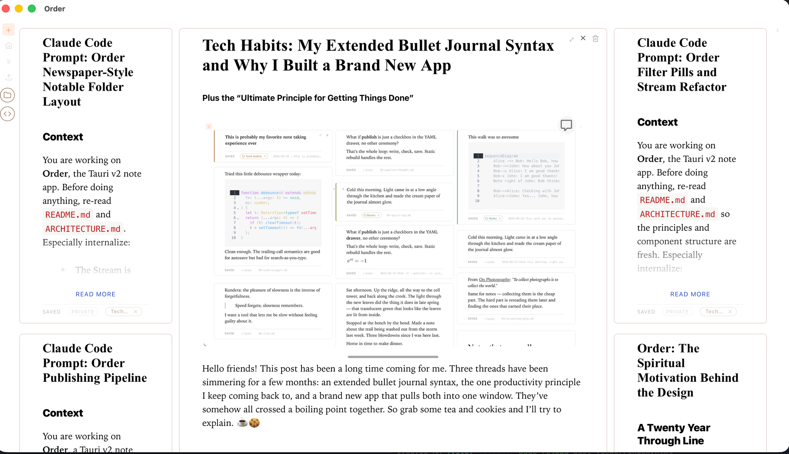

# Order

*Your notes, at home at last.*

A local-first notebook where **plain markdown files are the database**
and every surface — stream, calendar, seasons, todo.txt — is a
different read of the same files. Obsidian-compatible vault. One Tauri
codebase ships desktop and iOS.



**Demos:** [Basics](https://drive.google.com/file/d/1H2Yv9Jf59Og1bimFuDhJmIlOvjCA4iDp/view?usp=sharing) ·
[Lists](https://drive.google.com/file/d/1TdWU6fPFFOTDnodDT3AWenjyuuMRjffg/view?usp=sharing) ·
[Intro article](https://medium.com/@geetduggal/order-a-calendar-first-notebook-for-mapping-your-world-abc0970494a5)

## What you get

- **Edit in place** — WYSIWYG markdown cards (Milkdown Crepe). No modes, no preview pane.
- **A real hierarchy** — Areas → Categories → Notable Folders, capped Johnny-Decimal style at 10×10, stored as plain files.
- **A calendar that *is* your notes** — Day / Week / Month / Year / Season views over the same frontmatter Obsidian Full Calendar reads.
- **todo.txt as an event backing** — one line per event; markdown files only when there's prose worth keeping.
- **Seasons** — name your own date ranges and see each one as a grid of what actually happened, by Area.
- **Publish from the same vault** — flip `public: true`, push, done. The site runs the same components read-only.

## Build & run

```bash
git clone https://github.com/geetduggal/order.git && cd order
pnpm install
pnpm tauri:dev        # desktop, hot reload
pnpm tauri:ios:dev    # iOS simulator (after tauri:ios:init)
pnpm test:e2e         # Playwright suite
```

Prereqs: Node 20+, pnpm 9+, Rust 1.77+; Xcode 15+ for iOS. First
launch reads `~/Documents/Dropbox/Home/` (change it in Settings).

## A vault at a glance

```
<vault>/
├── Areas.md                      lists the Areas        (role: areas)
├── Seasons.md                    your named date ranges (role: seasons)
├── todo.txt                      one-line calendar events
└── Craft/                        an Area
    ├── Craft.md                  lists its Categories
    └── Craft Projects/           a Category
        ├── Craft Projects.md     lists its Notable Folders
        └── Map Pipeline v2/      a Notable Folder
            ├── Map Pipeline v2.md       the Main Document
            ├── 2026-06-12 Standup.md    a note (also a calendar event)
            └── diagram.png              attachments live WITH their notes
```

Five frontmatter keys carry all structure:

| Key | Makes a note… |
|---|---|
| `role: areas` / `seasons` | one of the two vault-root index files |
| `list: cards` \| `lines` | render its bullets as a visual list |
| `category: <Category>` | a Notable Folder's Main Document |
| `folder: "[[NF]]"` | a member of that Notable Folder |
| `date` + `startTime` / `allDay` | a calendar event |

Everything opens unchanged in Obsidian: same wikilinks, same
`![[image.png]]` embeds, same files.

## The surfaces

**Stream.** A masonry of editable cards, newest first. Focus on a
Notable Folder and it becomes a *newspaper section* — Main Document as
the centerpiece, recent notes orbiting it. Navigation is a pile: the
folder you touch goes on top.

**Calendar.** Day / Week / Month / Year. Drag to create, drag to move,
click for an action popup (rename inline, move to a day, reassign the
folder, open, delete). Events are just notes with a `date:`.

**Seasons.** List your own date ranges in `Seasons.md`:

```
- 2026-02-15 - 2026-04-30 · Spring Builds
- 2026-05-01 -            · Frontier
```

The Season view clusters every notable update (all-day event) by Area
over the range — which projects went well, which Areas were quiet, at
a glance. Arrows step between seasons like they step between weeks.

**todo.txt.** Flip one toggle in Settings and calendar events write to
a single text file instead of per-event markdown:

```
due:2026-06-13 07:30  Long run +weekly-hub end:09:30
due:2026-06-13 15:00  Ship Issue 22 +wide-margins end:17:00
due:2026-06-13        Ship to prod +map-pipeline-v2
```

`+project` fuzzy-matches a Notable Folder (kebab / camel / snake).
Events with real prose stay as markdown files; Order keeps both
backings in sync by identity `(date, start, title)` and renders each
event exactly once.

**Publish.** Notes with `public: true` build into a static site +
hydrated SPA (`Cmd+P`). Permalinks pin to the note, not its path, so
reorganizing the vault never breaks a link.

## Keyboard

| Keys | Action |
|---|---|
| `⌘N` | new note (title popup in calendar views) |
| `⌘D / W / M / Y / S` | Day / Week / Month / Year / Season |
| `⌘⌃ ← / →` | back / forward by the view's unit |
| `⌘O` · `⌘K` | folder palette (folders + todo.txt) |
| `⌘F` · `/` | full-text search |
| `⌘R` | home ⇄ clear-filters toggle |
| `⌘;` | sidebar · `⌘'` clear filters · `⌘T` theme · `⌘P` publish |
| `⌘+ / − / 0` | note text size |
| `?` | shortcut overlay |

The dock mirrors the essentials: **+** (new note in the home folder),
show-mode cycle, home ⇄ calendar toggle, search, settings, sidebar.

Nine themes (`⌘T`): light, dark, OLED black, WordPerfect, Terminal,
Typewriter, America, Christmas, LCARS — each ~15 lines of CSS variables.

## Going deeper

| Doc | What's in it |
|---|---|
| [docs/ARCHITECTURE.md](docs/ARCHITECTURE.md) | the mental model: code map, data flows, invariants |
| [docs/PHILOSOPHY.md](docs/PHILOSOPHY.md) | why it's shaped this way — piles, constraints, one vault two lives |
| [docs/RELEASING.md](docs/RELEASING.md) | building binaries, refreshing releases, App Store |
| `tests/e2e/` | Playwright suite + reusable vault linter (`ORDER_VAULT=… pnpm test:e2e consistency`) |

## Principles, in one breath each

1. **Plain text forever** — the files outlive the tool.
2. **Portable conventions** — the vault opens cleanly in Obsidian.
3. **Edit in place** — authoring and the finished thing are one surface.
4. **Constraint as clarity** — 10 Areas max, and that's the point.
5. **Workspace is presentation space** — publish ships what you see.
6. **Structure follows attention** — recently touched floats up.
7. **Speed matters** — every interaction budgeted under a second.

## License

MIT.
