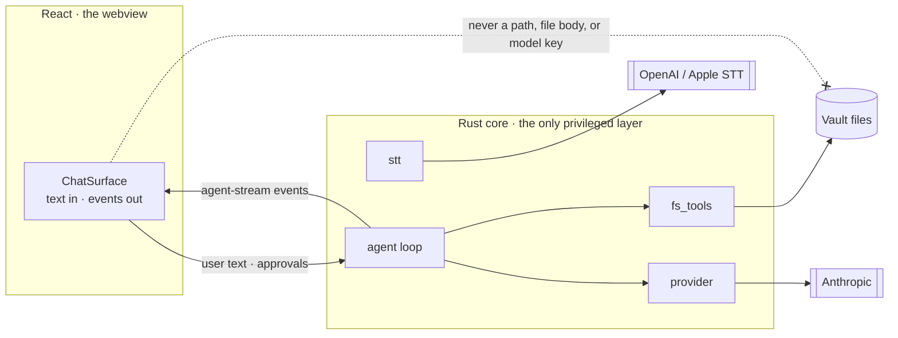

# Order — architecture

The whole app is one idea applied repeatedly: **plain text files are the database,
and every surface is a different read of the same files.** If you understand the
file conventions, you understand the app. The rest of this doc is how that idea
survives contact with a vault of tens of thousands of files.

## The data model (on disk)

```
<vault>/
├── spacetime.yml             canonical space + time map (YAML)
├── spacetime.mw              canonical space + time map (Markwhen)
├── todo.txt                  one-line calendar events (optional)
└── <Area>/
    └── <Category>/
        └── <NF>/
            ├── <NF>.md             the Main Document (category: <Category>)
            ├── 2026-06-12 Note.md  a note / calendar event
            └── diagram.png         attachments live WITH their notes
```

`spacetime.yml` and `spacetime.mw` are the source of truth for the vault's
**structure** (the Areas → Categories → Notable Folders hierarchy and its order)
and **seasons**. Both files are kept in sync; editing either one updates the
other. See [SPACETIME.md](SPACETIME.md) for the full format specification.

## Tech stack — what each layer is for

| Layer | Choice | Why this one |
|---|---|---|
| Shell | **Tauri v2** (Rust) | native file IO + system webview; one codebase ships macOS and iOS. ~10 MB binaries |
| UI | **React 19 + TypeScript**, Vite | one SPA rendered into the webview; HMR in dev |
| Editor | **Milkdown Crepe** (ProseMirror) | WYSIWYG CommonMark, uncontrolled after mount |
| Calendar | **FullCalendar v6** | drag/resize/select; Year and Season are hand-rolled |
| YAML | js-yaml | frontmatter parse/dump, `noRefs` + quoted strings |
| Watcher | notify (Rust), 500 ms debounce | external edits reach the UI without polling |
| Assets | `vaultasset://` URI scheme | images/video stream through native fetch with HTTP Range |

State management is deliberately primitive: **no Redux, no Zustand, no Context**.
`CardGrid.tsx` (~4k lines) owns `notes[]`, the view, and the filter pile;
everything derives per render.

```
CardGrid ── owns notes[], view, filters; routes every mutation
├── Sidebar           Areas → Categories → NFs drill + filter pills
├── LazyCell[] → Card per note: load → edit → debounced save
│   ├── MilkdownSurface   Crepe wrapper: paste, links, wikilinks
│   ├── RawTextSurface    monospace textarea for .txt/.yml/.mw files
│   ├── SheetSurface / DrawingSurface   flip a note to a spreadsheet / drawing (sidecar files)
│   ├── ListCards / ListLines / ListMasonry   list: cards/lines/masonry rendering
│   ├── NotableFolderBackside   flip side: folder browser + OS drag-drop
│   ├── ChatSurface     a `.chat.md` note → hands-free voice chat with the agent
│   └── OrderTerminal    in-card PTY (xterm.js), ⌘4 / button toggle
├── CalendarView      Day / Week / Month (FullCalendar)
├── YearLinearView    Year — 12×37 strip
├── SeasonView        Season — Areas grid over a date range
└── CommandPalette    ⌘O/⌘K folder picker · FtsOverlay ⌘F search
```

## File operations — everything goes through one bridge

The frontend never touches a filesystem API. Every operation calls a Rust command
via `lib/vault-fs.ts`, with **vault-relative paths**.

| Command | Used for |
|---|---|
| `vault_walk_metadata` | boot: every file's frontmatter, no bodies |
| `vault_read_text` / `vault_write_text` | note load on demand / debounced save |
| `vault_rename` / `vault_remove` | rename note, delete |
| `vault_backup` | timestamped full-vault snapshot to `.order-legacy/backup-<ts>/` |
| `fts_build_index` / `fts_search` | full-text search, Rust-side index |
| `terminal_open` / `_write` / `_resize` / `_close` | real PTY per in-card terminal |

The walk filter includes `.md`, `.txt`, `.yml`, `.yaml`, and `.mw` so
`spacetime.yml`, `spacetime.mw`, and `todo.txt` flow through the same load/reload
pipeline as markdown notes.

**The write path.** Card edits debounce 600 ms, then:
`splitFrontmatter → mutate → joinFrontmatter → vault_write_text`.
Every write stamps a 6-second **self-write marker** so the watcher doesn't reload
the card being typed in.

**The external-edit path.** notify (Rust, 500 ms debounce) → `vault-changed` event
→ JS coalesces 250 ms → metadata re-walk → notes matched by path so mounted editors
keep their cursor through a `git pull` happening underneath.

## Media: the `vaultasset://` URI scheme

Attachment images and videos are real files **in the vault** (`Attachments/foo.png`,
or right next to a note). On disk the markdown keeps the **vault-relative** path
(`![[foo.png]]`, ``) so notes stay portable and
Obsidian-compatible. A WebView can't load those directly, so a custom URI scheme,
`vaultasset://localhost/<vault-relative-path>`, bridges the gap: the Rust handler
(`lib.rs`) resolves the path against the same `VaultState` as the FS bridge, reads
the bytes, and serves them. At display time the body is **inflated** to the
`vaultasset://` URL; on save (and on copy) it is **deflated** back to the portable
source form (`lib/attachments.ts`).

Why a custom scheme rather than the stock `asset://` protocol, base64, or plain IPC:

- **Bookmark-aware access.** On iOS the vault lives outside the app sandbox and is
  reached through a security-scoped bookmark. Stock `asset://` can't go through that
  bookmark; the custom handler shares `VaultState`, so it works for a desktop
  absolute root and a bookmarked iOS folder alike.
- **HTTP Range — the load-bearing reason it's a URI scheme.** WebKit seeks video via
  `Range: bytes=…` requests. Without a scheme that answers `206 Partial Content`,
  every scrub re-downloads the whole multi-MB file, saturating the IPC bridge and
  freezing the UI. The handler serves capped 4 MiB slices on demand.
- **CORS.** On iOS the WebView origin is `tauri://localhost` while the asset is
  `vaultasset://` — a cross-scheme subresource load WKWebView blocks unless
  CORS-permitted, so the handler sends `Access-Control-Allow-Origin: *`. Desktop
  WebViews don't need it.

**iOS wrinkle.** Even so, `vaultasset://` doesn't reliably reach ``/`<video>`
in WKWebView, so on iOS the frontend fetches the bytes over the normal IPC bridge
(`vault_read_asset_bytes`) and swaps in a `blob:` URL (`lib/ios-images.ts`).

## Spacetime: the canonical map

`lib/spacetime.ts` is the heart of the data model. It owns the in-memory
representation (`SpaceNode[]` + `SpacetimeEvent[]` + `SpacetimeSeason[]`),
the YAML serializer/parser, the Markwhen serializer/parser, and the space-tree
mutation helpers.

### The mirror

A continuous `useEffect` in CardGrid regenerates `spacetime.yml` and `spacetime.mw`
on every notes change:

```
notes[] + vaultTaxonomy + parsedSpacetime
  → buildSpacetime()         preserves existing space+seasons from yml/mw,
  → serializeSpacetime()       regenerates events from note frontmatter
  → writeVault("spacetime.yml")
  → serializeMarkwhen()
  → writeVault("spacetime.mw")
```

A don't-clobber guard (`lastSpacetimeRef`) holds off the mirror write if the
on-disk file has been hand-edited since the last mirror write, so edits made in
the raw-text card or an external editor are never silently overwritten.

### Bidirectional sync

Both `spacetime.yml` and `spacetime.mw` are sources of truth:

- **spacetime.yml edit** → `parsedSpacetime` useMemo re-derives → taxonomy and
  seasons update on the next render cycle.
- **spacetime.mw edit** → `lastMarkwhenRef` guard detects the change →
  `parseMarkwhenFormat()` extracts space + seasons → written to `spacetime.yml`
  → triggers the taxonomy/seasons update. New events in `.mw` materialize as
  backing `.md` notes.

### Space mutations

All structure mutations (add/remove/reorder area, category, folder from the
sidebar or the apply-sync flow) call `applySpaceMutation()` in `lib/spacetime.ts`
and write the result to `spacetime.yml`. This replaces the old chain-file bullet
writes (`Areas.md`, `<Area>.md`, `<Category>.md`).

### Apply to vault

`lib/spacetime-sync.ts` diffs the on-disk file against the vault into a plan
(event create/update/delete, season change, folder add/remove/reorder). The plan
surfaces in a confirm dialog before any write; destructive ops are itemized.

### Vault migration

Settings → **"Migrate to spacetime…"** runs `lib/vault-migrate.ts`:
1. Full vault backup (`vault_backup` Rust command).
2. Plan: strip event YAML frontmatter from all event notes; archive `Areas.md`,
   `Seasons.md`, and category index files to `.order-legacy/chain/`.
3. Confirm dialog.
4. Execute.

After migration, `spacetime.yml` / `spacetime.mw` are the only structural records.

## Taxonomy

`lib/taxonomy.ts:buildVaultTaxonomy()` produces the `VaultTaxonomy` that drives
the sidebar and pile. When `spacetime.yml` carries a non-empty `space` tree, that
becomes the taxonomy. Otherwise it falls back to the chain index files, so
un-migrated vaults keep working without any change.

## Calendar events have two backings

An event is either a `.md` file (frontmatter `date`/`startTime`/`allDay`) or
one line in `todo.txt` (`due:YYYY-MM-DD HH:MM Title +project`). Identity is
`(date, startTime, normalized title)` — the calendar renders each once, `.md`
wins when both exist.

## Scaling to tens of thousands of files

1. **Metadata-only boot.** `vault_walk_metadata` ships one small struct per file
   — frontmatter YAML string, body byte-length, mtime. Bodies load lazily per Card.
2. **Lazy editor mounting.** `LazyCell` wraps each cell in an IntersectionObserver;
   offscreen cells render a placeholder.
3. **Pagination.** Unfiltered pile caps at 60 cards.
4. **Masonry without layout thrash.** CSS Grid with per-card ResizeObserver.
5. **Derived state, no caches.** Taxonomy tree, calendar events, season grids — all
   `useMemo` derivations over `notes[]`. No secondary store to drift.

## The agent + voice chat

An in-app agent that reads and edits the vault by voice. A chat is just a
`.chat.md` note in a Notable Folder — same plain-text principle as everything
else: delete the app and every conversation is still a readable transcript.

**The one conviction:** the entire agent loop lives in Rust. The model is a
*planner* that emits tool intentions; **Rust executes every tool, touches every
file, and makes every network call.** React never constructs a filesystem path,
never sees a file's contents on the way to the model, and never calls the model
API. This is what lets the same code run on macOS and iOS through Order's vault
abstraction. See `src-tauri/src/agent/` and `src-tauri/src/stt.rs`.

```
src-tauri/src/agent/
├── run.rs        the loop + Tauri commands (agent_turn / agent_new_chat / agent_approve)
├── provider.rs   ModelProvider trait → Anthropic (ureq + native-tls, SSE streaming, prompt caching)
├── tools.rs      tool schemas, dispatch, write-approval previews (with diffs)
├── fs_tools.rs   vault-relative, escape-rejecting file ops (list/read/search/write/edit/…)
├── chat.rs       the `.chat.md` format + incremental transcript writing
└── system_prompt.md
src-tauri/src/stt.rs   native mic capture (AVAudioRecorder) + STT (OpenAI / Apple)
src/lib/agent.ts       bridge: newChat / runTurn / approve + agent-stream events
src/lib/voice.ts       bridge: stt_listen / stt_cancel / stt_input_name + engine choice
src/lib/tts.ts         read-aloud engines + createStreamSpeaker (streamed playback)
src/lib/usage.ts       local token/second/char tallies → estimated cost, global + per-chat
```

### One turn, end to end

```mermaid
sequenceDiagram
    participant U as You (voice)
    participant CS as ChatSurface (React)
    participant STT as stt_listen (Rust)
    participant LOOP as agent loop (Rust)
    participant API as Anthropic API
    participant FS as Vault (Rust FS)

    U->>STT: speak
    Note over STT: AVAudioRecorder + VAD<br/>(stops on a pause)
    STT->>API: audio → OpenAI transcribe (or on-device Apple)
    API-->>STT: transcript
    STT-->>CS: text
    CS->>LOOP: agent_turn(chatPath, text)
    loop until no tool calls (cap: MAX_ITERS)
        LOOP->>API: messages + tools (SSE, cached system+tools prefix)
        API-->>LOOP: text deltas + tool_use blocks
        LOOP-->>CS: agent-stream (text / tool)
        alt read tool
            LOOP->>FS: execute, feed result back
        else write tool(s)
            LOOP-->>CS: agent-stream (approval + diffs)
            CS-->>LOOP: agent_approve(once/all/reject)
            LOOP->>FS: execute the batch
        end
    end
    LOOP->>FS: append reply to the .chat.md transcript
    LOOP-->>CS: agent-stream (final + token usage)
    CS->>U: stream reply to TTS as it arrives, then listen again
```

Text deltas are piped into the TTS speaker *as they stream*, so the reply starts
playing before the model has finished writing it (see Voice pipeline below).

**Trust boundaries** — who is allowed to do what:



### Design rules baked in

- **Reads flow freely; writes batch behind one approval.** The loop runs every
  read tool without asking and narrates it; all writes in a step are previewed
  together (with diffs, destructive ops flagged) and gated on a single
  once/all/reject. "Approve all" is per-chat and resets on the next chat.
- **Iteration ceiling.** A turn caps at `MAX_ITERS` model↔tool round-trips and
  says so if it hits the wall — no runaway loops.
- **Incremental transcript.** Each turn is appended to the `.chat.md` as it
  happens, so a crash never loses the session.
- **Folder-scoped context.** A turn is seeded with the folder's file index and
  its recent sibling chats (within a window), so continuity comes from the vault
  itself, not a hidden store.
- **Prompt caching.** The stable prefix — system prompt + folder context + tool
  definitions — carries an Anthropic cache breakpoint, so every turn after the
  first (and every tool-loop iteration) replays it from cache: faster
  time-to-first-token, ~1/10 the input cost. Cache read/write tokens come back on
  the stream and are counted separately.

### Voice pipeline

The hands-free loop is: **listen → transcribe → agent turn → stream reply to
speech → listen.**

**Capture + transcription.** WKWebView exposes no `getUserMedia`, so the mic is
captured **natively** (like TTS), never in the browser. `stt_listen` records one
utterance with `AVAudioRecorder`, watches the input level with an
adaptive-noise-floor VAD (calibrated per-room, peak-power based), and stops on a
pause — streaming `stt-level` to the meter and rejecting sub-350ms blips.
Transcription sits behind an engine choice: **OpenAI** (`gpt-4o-mini-transcribe`,
default — fast + cheap) or **Apple Speech** (`SFSpeechRecognizer`, on-device).
Whisper-style hallucinations ("thank you for watching" on quiet audio) are
filtered out. `stt_input_name` reports the live mic so the UI can show
headphones-vs-built-in.

**Streamed read-aloud** (`createStreamSpeaker` in `lib/tts.ts`). The reply is fed
to the speaker as its text deltas arrive, so playback begins before the model has
finished. Native voices speak sentence-by-sentence locally. Cloud voices (OpenAI
and ElevenLabs, handled identically) split the reply into ~180-char sentence
segments and **synthesize the next segment while the current one plays** — so
only ever *one* synth request is in flight. That single-request invariant is what
sidesteps ElevenLabs' concurrency limit and keeps OpenAI from wasting
parallelism, while still overlapping synthesis with playback for a short
time-to-first-audio. Playback is back-to-back through one `<audio>` element —
deliberately no MediaSource Extensions, which WKWebView doesn't support.

### Cost tracking

Everything metered locally in `lib/usage.ts`, never reported anywhere: Anthropic
tokens (split into input / output / cache-read / cache-write), OpenAI dictation
seconds, and read-aloud characters billed at the real synth call (so the mp3
cache never double-counts). Estimated dollars come from an editable rate table;
Settings shows a global per-service breakdown and each `.chat.md` shows its own
running cost.

## Invariants

- Quoted dates. `date: "2026-06-12"` — unquoted dates parse as YAML Date objects.
- Attachments live next to their note. Moving a note drags its images along.
- Wikilinks resolve by name, not path, so moving folders never rewrites links.
- The published web viewer reuses the same components read-only — no template drift.
- Structure mutations write `spacetime.yml` / `spacetime.mw` only — no chain files.

## Testing

`pnpm test:e2e` runs Playwright against the real app in Chromium with a mocked Tauri
IPC layer. Pure-node spec files (`tests/e2e/*.spec.ts`) cover spacetime serialization,
sync planning, space mutations, and vault migration planning.
